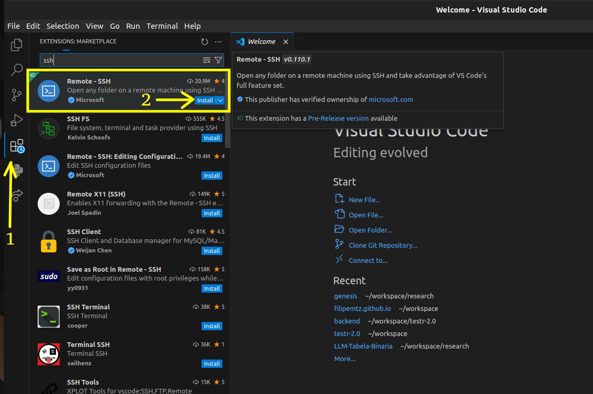
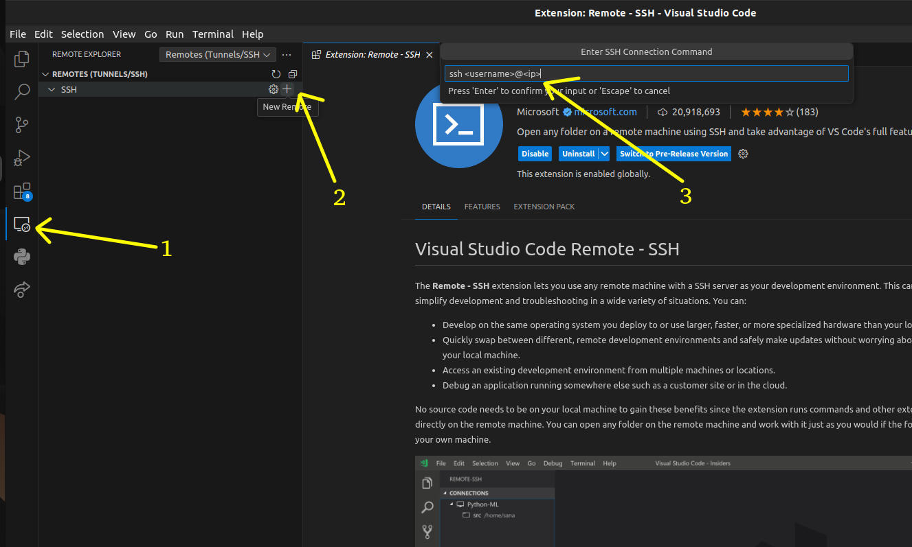
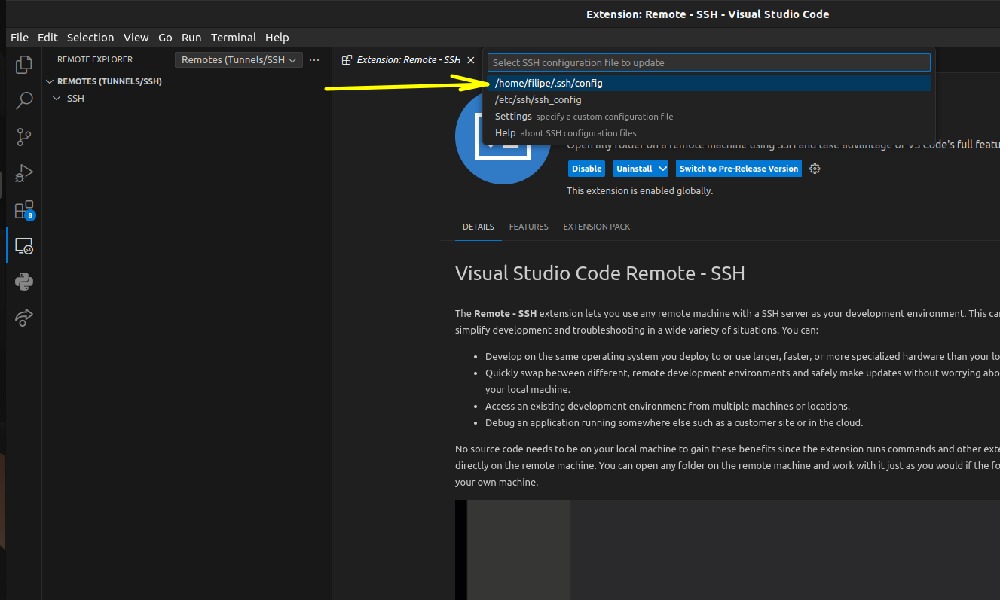
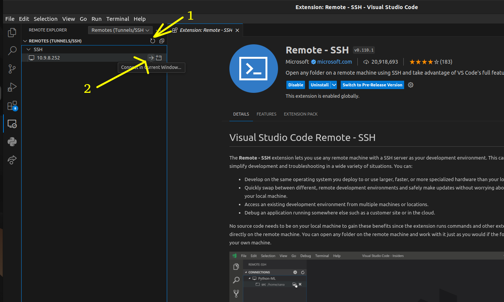
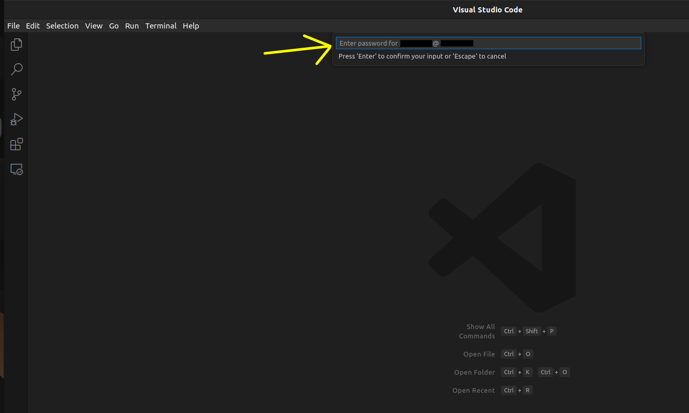
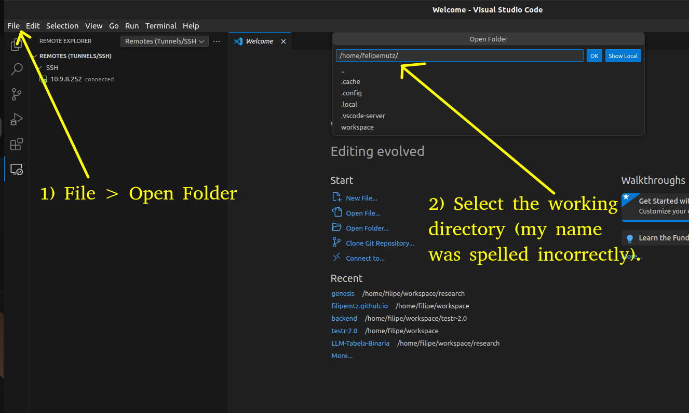
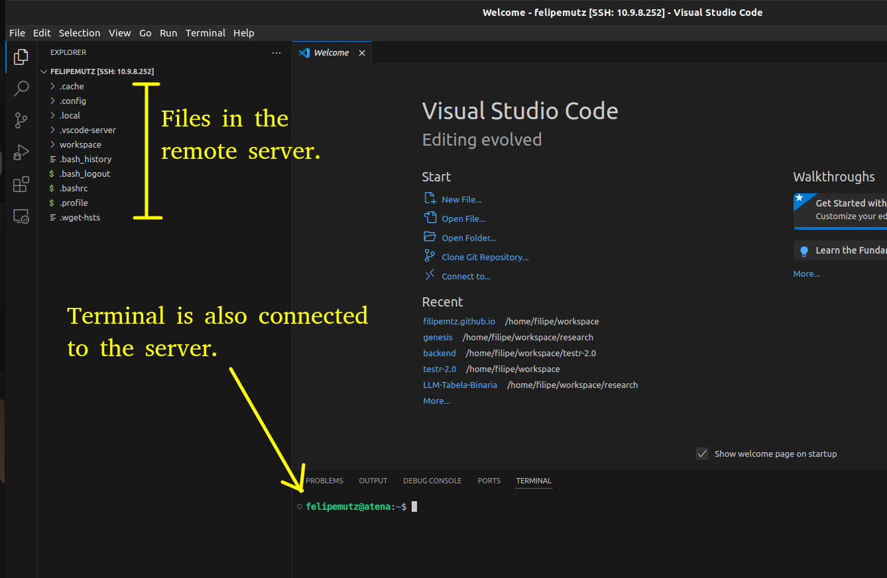

Install the "Remote - ssh" extension by Microsoft.



Select the "+" button to add a new connection and type the ssh command in the pallete (e.g., `ssh johndoe@10.9.8.13` or `ssh johndoe@myserver`).



Select the ssh configuration file to updated. If you're not sure, select the default (first on the list).



Click the refresh button to update the viewer with the new connection. Then, click the arrow button to connect to the server in the current window or the next icon to open a new window.



Type your password.



After the previous step, you're already connected to the remote server. To visualize your files, select the option "File > Open Folder" in the menu. Next, choose a folder from the server to open.



The files should appear in the left panel. Also, if a new terminal is created (e.g., choosing the option "Terminal > New Terminal" in the main menu), the terminal should also be connected to the server.



To copy files to the remote server, use the `scp` command:

```bash
scp -r <origin-directory> <user-name>@<IP>:<destination-directory>
```

For example, the following copy the `data` directory to the home directory of user `johndoe` in the server with IP `200.111.222.333`:

```bash
scp -r data/ johndoe@200.111.222.333:~/
```

Likewise, the `scp` command can also to copy files from the remote server to your computer:

```bash
scp -r my-user-name@10.9.8.000:~/my-remote-directory/   my-local-directory/
```
