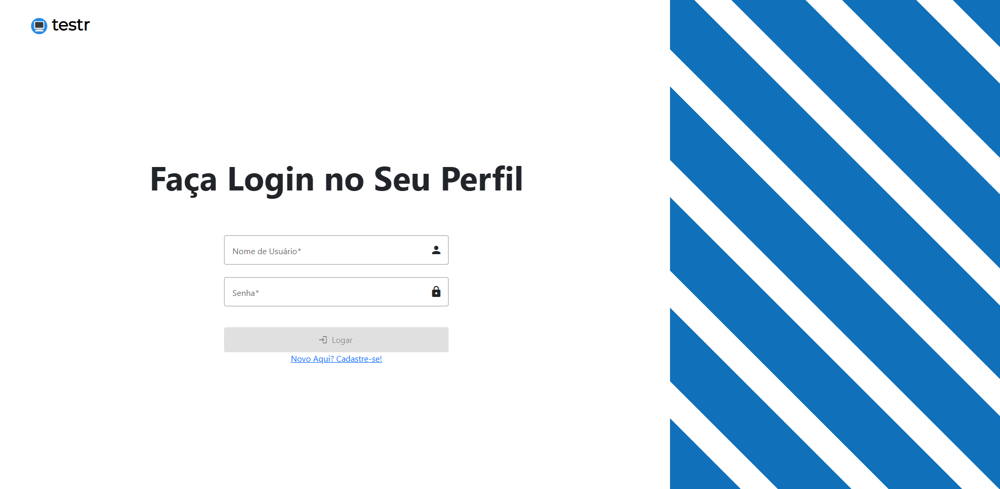
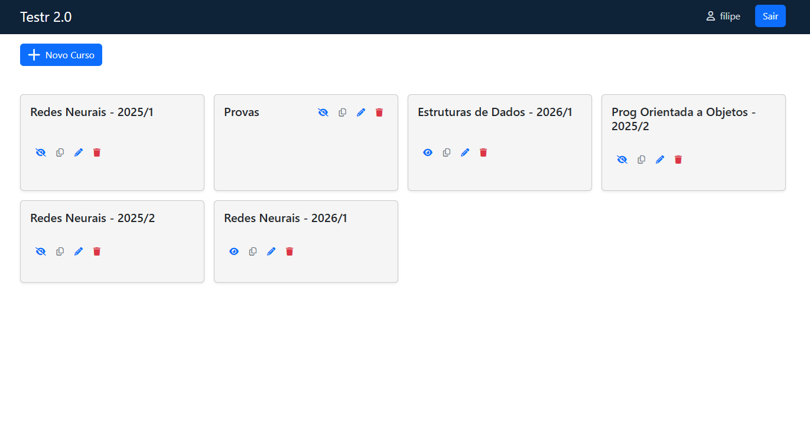
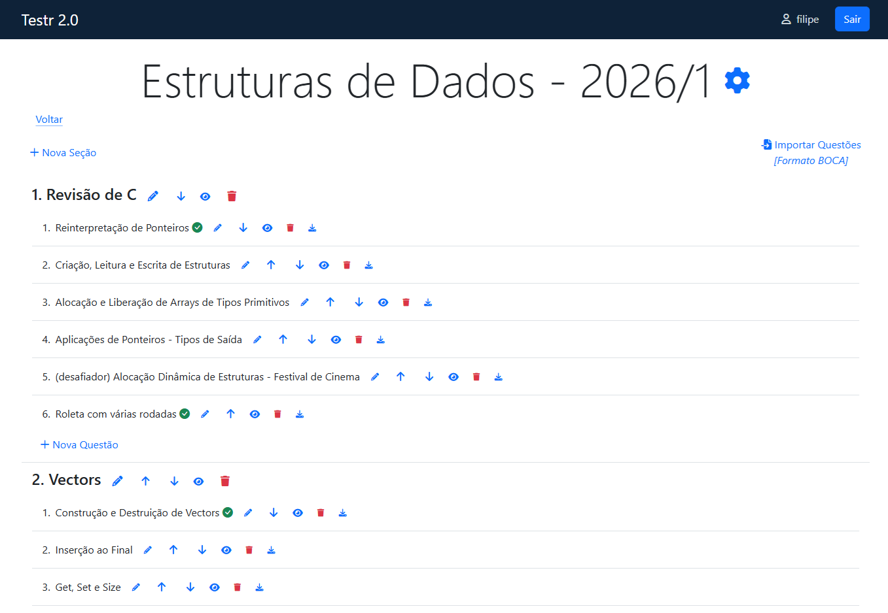
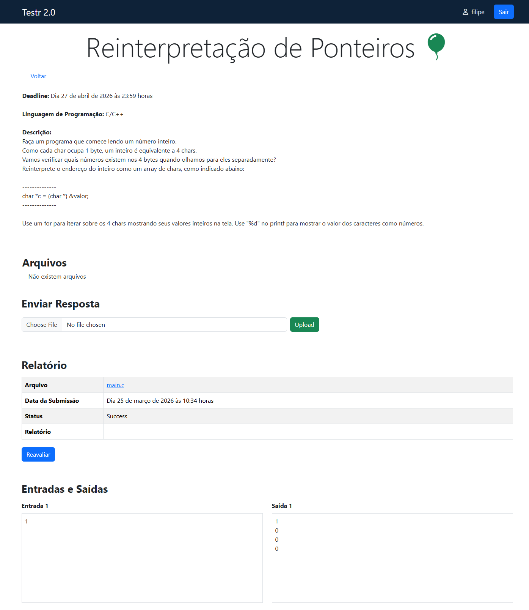

## Informações Gerais

Este projeto teve como objetivo geral construir e popular com atividades um sistema computacional em que estudantes pudessem realizar atividades de programação com correção automática. O uso de tais sistemas para apoio às disciplinas de programação permite que os estudantes realizem de grandes quantidades de atividades e a correção automática dá ao aluno a capacidade de autoavaliar seu progresso nas disciplinas. Eles permitem ainda que pontos de dificuldade sejam identificadas de forma que juntos, docentes e discentes, possam desenhar estratégias de estudo para superar estas dificuldades.

**Financiamento**: Edital Edital Prograd/Ufes nº 043/2023

[Relatório do projeto](relatorio-testr.pdf) (páginas contendo informações pessoais foram removidas).

## Imagens do Sistema

Página de Login

Visualização de Disciplinas

Tópicos e Questões

Página de Submissão de Respostas

