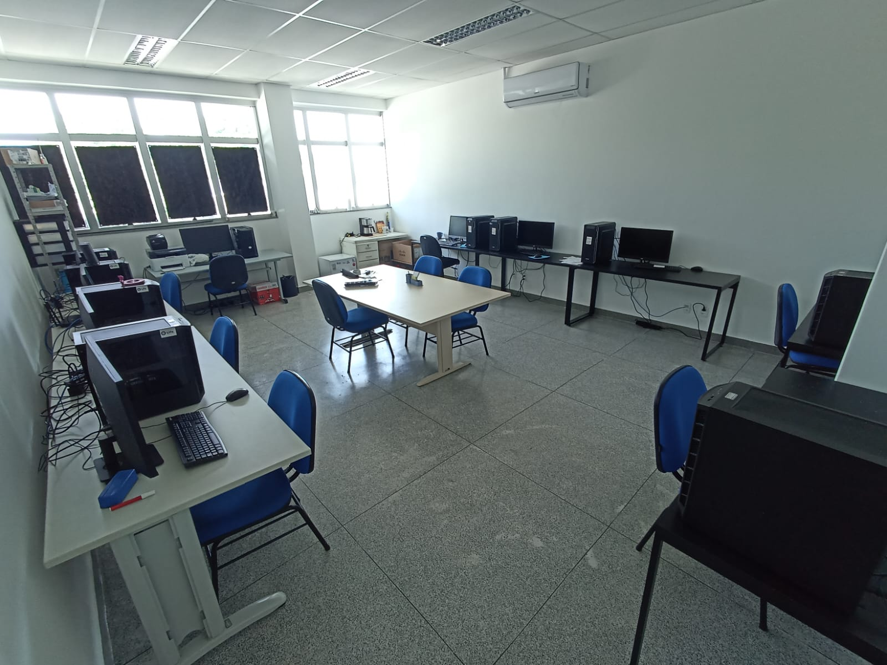
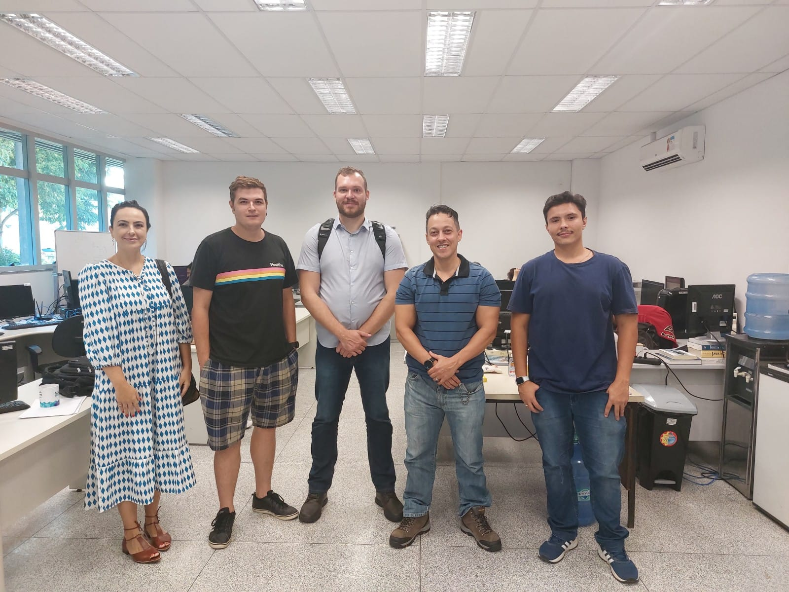
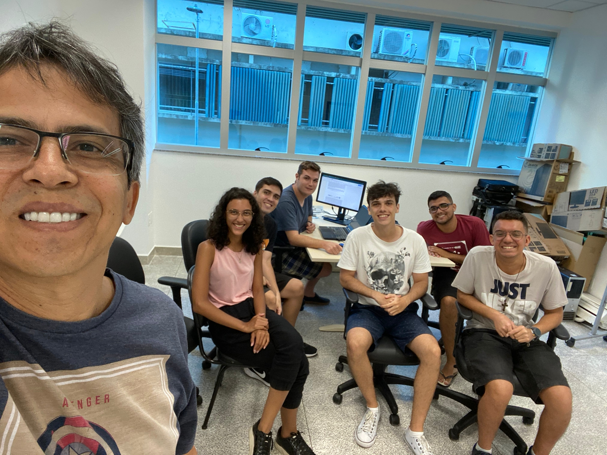
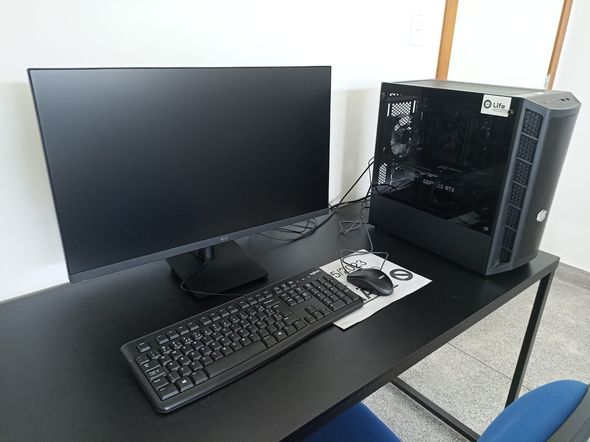

O objetivo geral deste projeto foi criar, equipar e divulgar um laboratório multidisciplinar de informática aplicada à saúde com intuito de promover a integração de especialistas e potencializar o ensino, pesquisa, extensão, inovação e desenvolvimento tecnológico nestas áreas. Como resultado do projeto, foi criado o [Laboratório de Inteligência Artificial em Saúde (Life)](https://life.inf.ufes.br/) atualmente localizado na sala 27 do [prédio CT-13](https://maps.app.goo.gl/vYBDeZQzcN9bEMNx5).

**Financiamento**: Edital FAPES Nº 21/2022

---

Estrutura do laboratório.

Alguns dos membros fundadores.

Alunos e professores que atuaram em projetos do Life.

Exemplo de computador de alto-desempenho adquirido para o laboratório.

