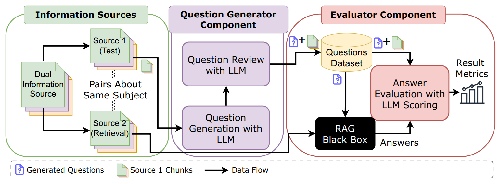

*Link to the paper is coming soon!*

## TL;DR

Traditional RAG evaluation methods often use a **single source for both, retrieval context and assessment**, leading to **performance overestimation**. RAG-ME addresses this by using a dual-database approach in which assessment questions are generated with one source, while  a separate source acts as knowledge base for the RAG system. **This approach provides more realistic performance estimates** and better differentiates between model capabilities.

## Abstract

Traditional Retrieval Augmented Generation (RAG) system evaluation often suffers from optimistic bias when using a single text source for both question generation and retrieval context. This paper introduces RAG-ME, a framework whose core contribution lies in decoupling the text source for question generation from the source used for retrieval context. RAGME employs one source to generate  valuation questions and a distinct, similar source to provide the context for answer retrieval. System-generated answers are then evaluated with LLM-as-aJudge. Our experiments, conducted  n scientific papers and veterinary pathology textbooks, indicate that RAG-ME’s dualdatabase approach yields a fairer  assessment, significantly reducing bias and more effectively differentiating model capabilities compared to conventional single-database methods. Furthermore, RAG-ME's capacity of analyzing retrieval parameters (e.g., chunk size and overlap) highlights its practical value for system optimization, offering a cost-effective and reliable tool for advancing fairer RAG assessment.