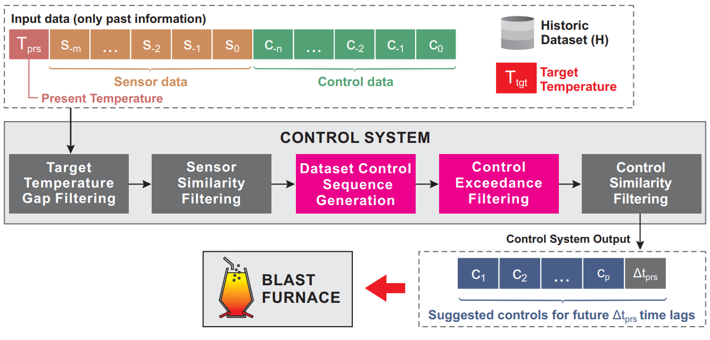

*Link to the paper is coming soon!*

## Abstract

Controlling the hot metal temperature (HMT) in blast furnaces is essential for safe and efficient ironmaking operations, as it directly affects product quality and process stability. Previous investigation showed the feasibility of a datadriven control system based on historical actions performed by human operators. However, the suggested control values, based on past values plus a variation (delta), may exceed operational limits and require clipping before application, which can reduce control quality. This work proposes an improved control system that introduces a heuristic for filtering historical actions during control sequence generation in order to reduce clipping effects, as well as a new similarity metric for sample retrieval. Robustness and stability are evaluated using multiple furnace proxy models, including a newly introduced LSTM model, and through experiments conducted under different levels of noise. Results show improved accuracy and stability across all scenarios and noise conditions.

