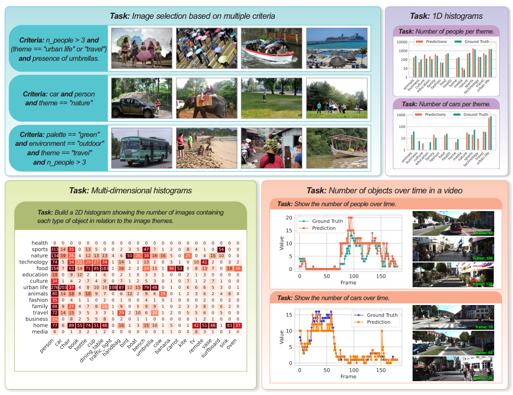
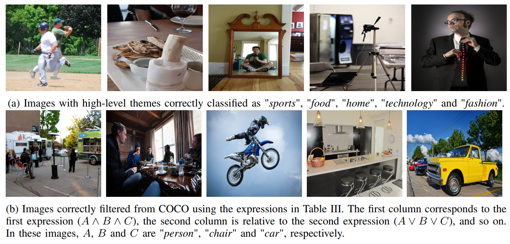

*Link to the paper is coming soon!*

Supplementery Material: [https://github.com/filipemtz/ViLMA](https://github.com/filipemtz/ViLMA).

## TL;DR

The work proposes ViLMA, a system based on Vision-Language Models to perform meta-analyses over large image databases. VLMs struggle to aggregate information across large collections and perform precise numerical, statistical, and logical computations.

By extracting semantic information from individual images and storing it in a structured tabular representation, ViLMA enables users to filter, aggregate, and analyze large image datasets through complex queries without requiring additional VLM inference.

![System overview. ViLMA takes as input a set of images (or videos) and a set of questions regarding specific aspects of them. The system iterates over the images and questions using a VLM to answer each question for each image. Responses are stored in a tabular representation in which rows represent images and columns represent questions.  Given this tabular representation, scripts (handcrafted or AI-generated using LLMs) can filter images using logical expressions, compute statistics, and generate visualizations.](system-overview.png)

## Abstract

Vision-Language Models (VLMs) demonstrated remarkable capabilities in image understanding and question answering. However, they struggle with tasks that require information integration and face limitations in context length and GPU memory when processing long image collections end-to-end. To address these challenges, we introduce the VLM-based Meta-Analysis System  (ViLMA). Given a set of images and questions, ViLMA  iterates over image-question pairs, leveraging a VLM to answer each independently. Responses are stored in a tabular representation so that users can create multi-criteria expressions, filter images based these criteria, compute statistics, and generate visualizations. ViLMA  innovates by introducing a new layer of abstraction over VLMs enabling non-technical users to perform complex analyses of large datasets via text inputs. Experiments show that state-of-the-art VLMs cannot solve these tasks by themselves and demonstrate the effectiveness of the proposed system in different applications.

## Tasks

The following images illustrate some tasks that the proposed apprach can address.

