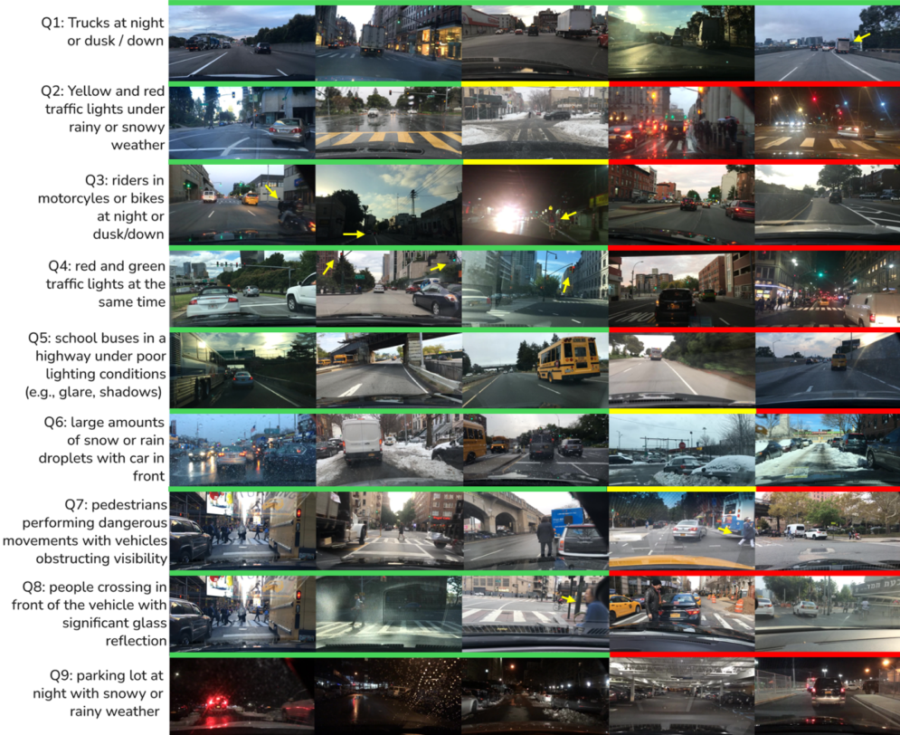

*Link to the paper is coming soon!*

## TL;DR

The work proposes a framework based on LLM agents to search for long-tail samples in large sensor databases. This is important because the majority of collected samples correspond to routine and benign scenarios, while rare but safety-critical events occur with low frequency. Tools to aid in the search for uncommon, safety-critical, events contribute to the proper evaluation and operation of self-driving software in adverse conditions.

## Abstract

Robust autonomous driving systems depends on the ability to identify and evaluate rare, safety-critical scenarios that lie in the long tail of real-world data distributions. Existing approaches for long-tail mining either lack support for compositional, multi-criteria queries or fail to reuse information efficiently across searches, limiting their scalability and practical utility. This paper introduces an agentic framework based on large language models (LLMs) and vision-language models (VLMs) for flexible discovery of long-tail events in autonomous driving datasets. Given a natural-language query describing a target scenario, the system decomposes it into atomic criteria, evaluates each criterion independently using a VLM, and synthesizes executable code to retrieve samples that satisfy the original query. A persistent semantic cache ensures that each visual attribute is computed at most once per image, enabling efficient reuse across queries and substantially reducing computational cost. The framework supports text-based interaction, allowing guidance of the mining process, even by nonexpert users. Experiments on the BDD100k dataset demonstrate that the proposed approach accurately retrieves increasingly complex and rare scenarios, achieving high precision despite the inherent difficulty of long-tail conditions. Qualitative results further show that the system can uncover challenging corner cases relevant to perception and planning.

{width=85%}

