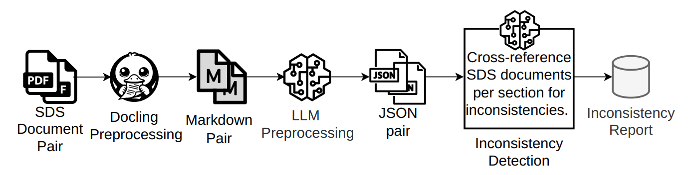

*Link to the paper is coming soon!*

## Abstract

Safety Data Sheets (SDS) are critical regulatory documents detailing the hazards of a chemical substance. Maintaining SDS consistency across versions of the same substance is vital for occupational safety. Nonetheless, automated detection of relevant safety-related contradictions in this specialized domain remains unexplored in the current literature. To address this gap, this paper evaluates the capability of LLMs to automatically detect inconsistencies by leveraging section-based document structure. To assess our solution, we implemented an automated inconsistency-injection pipeline and evaluated results via an independent LLM-as-a-judge framework, comparing models of different parameter scales on both clean synthetic and noisy real-world hybrid datasets. The top-performing LLM, Llama-4- Maverick, achieved an F1-score of 84.9% on the hybrid dataset. Smaller models, such as Qwen3.5-9b, showed strong ability to recover inconsistencies at the cost of lower precision. Overall, we conclude that LLM-driven pipelines can significantly accelerate automated compliance auditing and reduce human oversight risks in chemical safety workflows.

