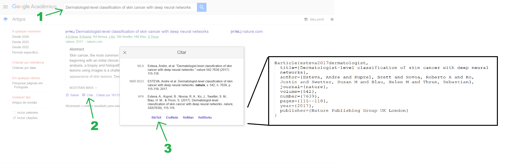

## Como começar a escrever rápido e sem travar?

- **Faça uma lista informal de tópicos (bullet points) descrevendo o que você quer falar:** Isto te ajuda a organizar as idéias e ter uma visão em alto-nível da argumentação. O fato de ser algo só para você e não ter pressão para ficar bom tende a colocar a mente em modo criativo.

- **Comece e depois melhore:** Depois de fazer os tópicos, comece a despejar todas as informações que você acha que deveriam entrar abaixo de cada tópico. Mantenha uma estrutura de parágrafo, mas não se preocupe com ortografia, conexão entre sentenças, etc. Xingue, faça piadas, abrevie, use emojis, faça o que for necessário para se manter adicionando conteúdo com leveza. Quando sentir que adicionou uma quantidade significativa de texto (e.g., uma seção ou um parágrafo muito crítico), revise e refatore o que você fez para deixar com a cara de texto acadêmico. É muito mais fácil convencer o cérebro a melhorar algo que já está quase pronto do que começar algo novo do zero.

- **Pomodoro e a regra dos dois minutos:** Estas técnicas têm como objetivo reduzir a resistência do seu cérebro em começar. É normal ter dias em que você não está com a mínima vontade de fazer uma atividade. Aconteceu comigo várias vezes. A técnica do pomodoro consiste em iterar intervalos de trabalho focado e de diversão e relaxamento. O pomodoro clássico sugere 25min de trabalho seguidos de 5min de descanso com uma pausa mais longa a cada hora. Quando sua mente começar a se distrair, lembre-se que você vai ter tempo para isso em breve. A configuração que funcionou bem comigo foi fazer 1h de trabalho seguido de 1h de diversão. Parece muito se permitir 1h de diversão, mas na prática 4h de trabalho focado rendem mais que 8h de trabalho disperso. A regra dos dois minutos consiste em estabelecer uma meta tão pequena que seu cérebro não crie resistência, por exemplo, escrever 1 frase. A esperança é que depois de começar, você acabe escrevendo mais, mas mesmo se isso não acontecer, 1 frase é melhor que 0. Considere o objetivo alcançado e descanse para aumentar a chance de acordar com mais disposição nos próximos dias.

## Recomendações de escrita

- Sempre que possível escreva de forma *top-down*. Comece em níveis mais altos de abstração e depois vá para os detalhes.

- Opte por frases curtas, de no máximo 3 linhas. Sabe quando você esbarra em uma função muito grande no código e decide quebrar em funções menores para ficar mais fácil de entender? A lógica é a mesma. Cada frase deve conter uma idéia apenas. Frases curtas tornam o texto mais fácil de escrever e de ler.

- Parágrafos com uma frase apenas são muito curtos. Anexe a frase ao parágrafo de cima ou de baixo dependendo de qual fala sobre assuntos mais próximos. Parágrafos que ocupam mais de meia página são muito longos. Quebre em parágrafos menores.

- A mesma lógica vale para seções e capítulos. Uma seção com um parágrafo apenas não precisa existir. Anexe o parágrafo à seção anterior ou posterior. Se um capítulo só tem uma subseção, apenas remova o título da subseção e faça o capítulo ser um texto corrido apenas.

- Escreva de forma clara, simples e objetiva. No texto científico, queremos maximizar precisão e compreensão. Evite expressões mais complexas que o necessário.

- Use as mesmas palavras para se referir aos mesmos objetos. Repetição é menos problemático que confusão.

- Mantenha consitência na forma como você escreve as coisas. Por exemplo, todas as seguintes possibilidades são válidas para se referir à métrica: "f1-score", "F1-score", "medida F1", "F1", mas você deve escolher uma delas e usar sempre a mesma.

- Palavras em inglês devem ser colocadas em itálico, exceto caso sejam acrônimos (e.g., "CNN").

- Lista de siglas e apêndices podem ser removidos se não forem utilizados.

### Matemática

- Equações matemáticas devem ser escritas usando o ambiente equation. O campo `\label` é opcional, mas permite referenciar o número da equação.

```latex
\begin{equation}
f(x) = x^2
\label{eq:identificador}
\end{equation}
```

- Expressões matemáticas que apareçam no meio de frases ou menções a letras e funções devem ser escritas entre `$` e `$`, por exemplo, `$f(x) = x^2$`.

### Referências

- Sempre que você fizer uma afirmação que não for obviamente verdade (e.g., "o número de empréstimos no Brasil cresceu nos últimos 5 anos" ou "AVCs são a maior causa de mortes no mundo"), você deve citar para um trabalho que comprove aquela afirmação. Também devem ser adicionada uma citação na primeira menção a métodos ou métricas que não forem explicados no texto.

- Como indicado abaixo, uma forma fácil de obter a entrada bibtex da referência é buscar o nome do artigo no [google scholar](https://scholar.google.com.br/), clicar no botão citar e depois em bibtex. Para referenciar um artigo no texto, use `\cite{esteva2017dermatologist}`, onde o item ente chaves é o identificador do artigo no arquivo `.bib`. Este tipo de referência deve ser usado no final das frases.



### Figuras e Tabelas

- Todas as figuras e tabelas devem ser referenciadas e descritas no texto pelo menos uma vez. Não deixe a figura flutuando assumindo que o leitor vai saber quando deve pausar a leitura para olhar a figura e como deve interpretá-la. Você deve guiar ele neste processo. Identificadores podem ser adicionados usando `\label{identificador}` e o número pode ser referenciado usando `\ref{identificador}`. No caso de gráficos, dê mais detalhes, e.g., "O gráfico da Figura 4 compara o tempo de execução dos algoritmos avaliados. O eixo horizontal representa o tamanho da entrada e o eixo vertical representa o tempo em segundos. Como pode ser observado, o algoritmo X (azul) alcançou o menor tempo tempo para entradas grandes.".

- Referencie os números ao falar de figuras e tabelas e não use a posição espacial na página como em "A figura abaixo/acima mostra ...".

- Ao falar de uma figura ou tabela específica, use letra maiúscula, por exemplo, "A Figura 3 apresenta uma visão geral do sistema.".

- Tabelas que comparam métodos devem destacar os melhores valores em cada métrica usando negrito.

- Por padrão, deixe o latex decidir onde colocar figuras e tabelas. Não tente forçar que elas fiquem em posições específicas do texto.

- Evite figuras grandes demais ou com textos pequenos demais. Ajuste o tamanho da fonte para que textos sejam legíveis sem esforço com zoom em 100% e fiquem mais ou menos do mesmo tamanho do restante do texto. Para julgar se suas figuras estão boas, olhe para os trabalhos relacionados e projetos anteriores e veja se estão com a mesma cara.

- Ferramentas de IA Generativa podem te ajudar a gerar código para produzir gráficos bonitos. Não adicione dados no prompt, mas solicite que o código leia os dados de um arquivo por conta do risco de alucinação.

- Figuras e gráficos com a mesma temática e aproximadamente o mesmo tamanho [podem ser colocadas lado a lado](https://www.overleaf.com/learn/latex/How_to_Write_a_Thesis_in_LaTeX_(Part_3)%3A_Figures%2C_Subfigures_and_Tables#:~:text=We%27ll%20do%20an,in%20the%20document%3A).

## Como revisar o texto?

- É muito difícil para o orientador contribuir com um texto com muitos erros de português, com palavras faltando ou frases que não se conectam logicamente. Não é papel da pessoa que está revisando seu texto fazer *parsing* do que você tinha intenção de dizer no meio de uma bagunça. Então, por favor, **faça um esforço para enviar um texto com mais cara de versão final**.

- **Leia o texto pelo menos duas vezes depois de escrever falando as palavras**, mesmo que seja sem deixar o som sair, só mexendo a boca. O processo de recitar o texto vai te ajudar a identificar e corrigir erros de português, frases difíceis de entender, pontos de pausa que precisariam de vírgulas e pontos, frases longas demais, etc.

- Use ferramentas computacionais para apontar erros de gramática ou frases mal estruturadas. Você pode inclusive usar IA generativa para fazer estas melhorias de escrita, mas é **fundamental que você verifique tudo que ela retornar por conta do risco de alucinações**. Não envie mais de dois parágrafos por vez. Quanto maior o texto, maior a chance de ela cometer um erro no meio e você não perceber.

- Para verificar se uma seção está fazendo sentido logicamente, **tente resumir cada parágrafo em um tópico e veja se a sequência de tópicos está fazendo sentido**. Se for difícil colocar em um tópico ou a sequência estiver estranha, refatore. Esta análise pode ser feita mentalmente.

## Antes de enviar um texto para seu orientador, faça este checklist

- Você leu o que escreveu pelo menos duas vezes.
- Revisão ortográfica foi feita.
- A argumentação está fazendo sentido logicamente.
- Termos em inglês estão em itálico.
- Não existem parágrafos, seções ou capítulos pequenos demais ou grandes demais.
- Todas as figuras e tabelas são referenciadas e descritas no texto.
- Figuras, tabelas e equações foram referenciadas com letra maiúscula (e.g., "a Figura 1", "a Tabela 3").
- O tamanho das figuras, a fonte, o posicionamento e a legenda  estão adequados.
- Não existem referências repetidas.
- Termos foram usados consistentemente.

