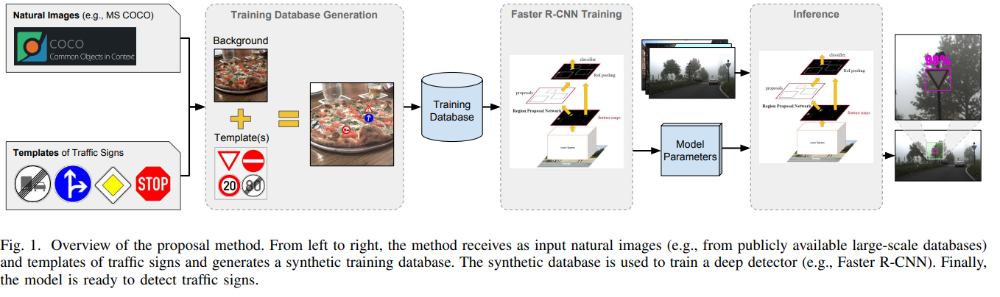
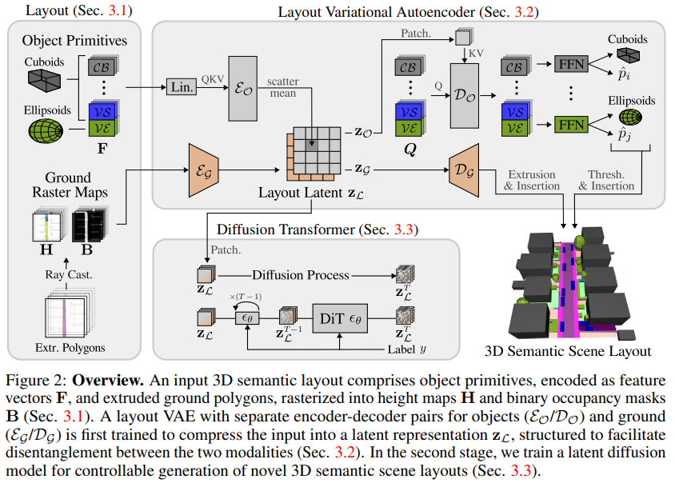
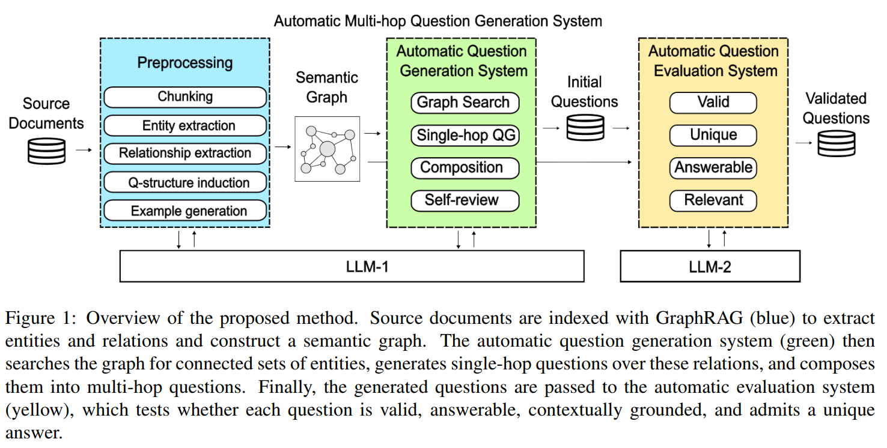

O capítulo de desenvolvimento deve descrever o que você fez de forma que os interessados possam replicar o seu trabalho. A escrita deve seguir uma abordagem *top-down*, em que você inicia em um nível alto de abstração, descrevendo as grandes etapas e como elas se comunicam (entradas e saídas), e depois detalha cada etapa em uma seção específica. Para ajudar na descrição mais em alto nível, deve ser criada uma figura de *overview*. Alguns exemplos seguem abaixo.

---

---

---

---

Ao descrever o método, **evite entrar em detalhes de implementação** como organização de arquivos e pastas, nomes de funções, classes ou variáveis, etc. Lembre-se que **o objetivo é permitir que outros pesquisadores consigam reproduzir o que você fez**.

Na maioria dos casos, o método não vai deixar de funcionar ou perder a característica porque a pessoa usou outra linguagem de programação/biblioteca, ou porque usou nomes diferentes dos seus, concorda? Algumas exceções são:

- Implementações de algoritmos podem mudar entre versões de bibliotecas o que pode levar resultados diferentes daqueles reportados no trabalho. Uma forma de lidar com este fato é adicionar um parágrafo (ou seção dependendo da quantidade de texto necessário) para listar as versões dos softwares e bibliotecas utilizados.
- Trabalhos cujo foco sejam tecnologias específicas, por exemplo, implementação de versões paralelas de algoritmos em CUDA, naturalmente precisarão entrar mais em detalhes de implementação e talvez até adicionar trechos de código-fonte.

Para garantir reprodutibilidade, você deve mencionar **todos os passos seguidos** (e.g., etapas de pré-processamento de bases de dados), justificar decisões, informar valores de hiperparâmetros e ser preciso nos protocolos de treinamento e avaliação de modelos. Embora escrito textualmente, **o documento deve refletir o código** no sentido de que seja possível reconstruir o software do zero (a menos de mudanças de nome) olhando apenas para o texto. Use pseudo-códigos, formulações matemáticas e diagramas para tornar explicações tão claras e precisas quanto possível.
